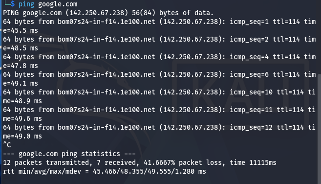
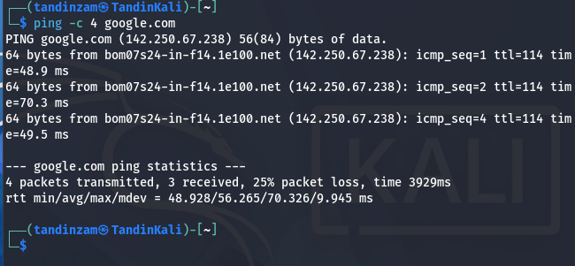
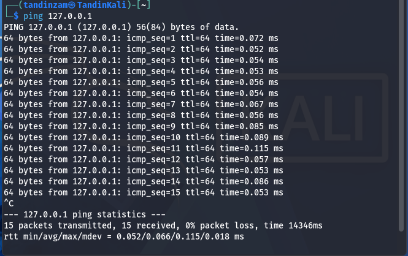
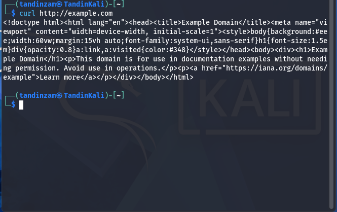
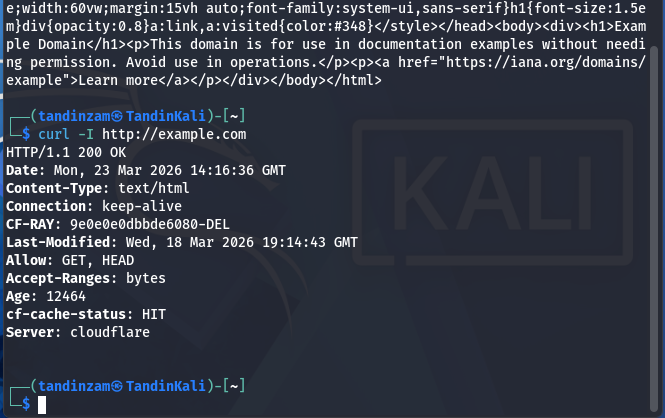
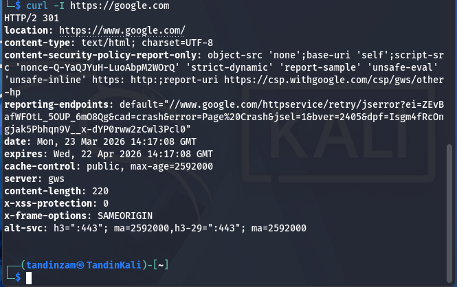
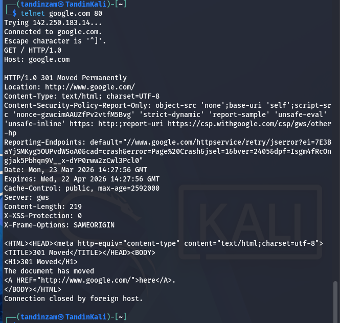
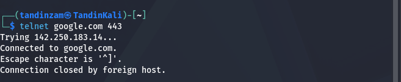

*LAB 01**

**CLI Protocol Tools: PING • CURL • TELNET**

Student: Tandin Zangmo  |  Platform: Kali Linux  |  Date: 23 March 2026

# **Aim of the Lab**

To understand how different network protocols work using command-line tools such as PING, CURL, and TELNET. Students will observe ICMP connectivity testing, HTTP/HTTPS web communication, and direct TCP service interaction.

# **Part A: PING (ICMP Protocol)**

PING uses ICMP (Internet Control Message Protocol) Echo Request and Echo Reply messages to test network connectivity and measure round-trip time (RTT) to a remote host. DNS resolves the domain name to an IP address before any packets are sent.

## **Task 1 — ping google.com**

**Command:**

ping google.com

**Screenshot:**

**Observations:**

Google.com resolved to IP 142.250.67.238 via DNS. ICMP Echo Requests of 56(84) bytes were sent continuously. 12 packets were transmitted, 7 received, showing 41.67% packet which indicates an unstable network connection. Round-trip time (RTT) ranged from 45.5 ms to 49.6 ms with an average of 48.355 ms. TTL=114 indicates the packet traversed approximately 14 routers (128-114=14 hops). The test was stopped manually with Ctrl+C.

## **Task 2 — ping \-c 4 google.com**

**Command:**

ping \-c 4 google.com

**Screenshot:**

**Observations:**

The \-c 4 flag limited the ping to exactly 4 packets. 4 packets were transmitted, 3 received, showing 25% packet loss. RTT ranged from 48.9 ms to 70.3 ms, with an average of 56.265 ms. The statistics section at the end shows total time taken (3929 ms) and mdev (mean deviation of 9.945 ms) indicating some variance in response times. This is a common method used to quickly test connectivity with a fixed packet count.

## **Task 3 — ping 127.0.0.1**

**Command:**

ping 127.0.0.1

**Screenshot:**

**Observations:**

127.0.0.1 is the loopback address and it always refers to the local machine itself. No DNS lookup was needed since an IP address was provided directly. 15 packets were transmitted and 15 received with 0% packet loss, confirming the TCP/IP stack is functioning correctly on the local machine. RTT was extremely low (average 0.066 ms) because packets never leave the rather they loop back internally. TTL=64 is the default Linux TTL value.

# **Part B: CURL (HTTP Protocol)**

CURL is a command-line tool for transferring data using URLs. It uses DNS to resolve hostnames, then establishes a TCP connection and sends HTTP requests. It supports HTTP, HTTPS, FTP, and many other protocols.

## **Task 4 — curl http://example.com**

**Command:**

curl http://example.com

**Screenshot:**

**Observations:**

CURL successfully resolved example.com via DNS and retrieved the full HTML source of the webpage. The response includes the complete HTML document with DOCTYPE, head, title, style tags, and body content. The page title is 'Example Domain' and it is maintained by IANA for documentation purposes. This demonstrates a successful full HTTP GET request — CURL connected to the server, sent the request, and displayed the raw HTML response.

## **Task 5 — curl \-I http://example.com**

**Command:**

curl \-I http://example.com

**Screenshot:**

**Observations:**

The \-I flag sends an HTTP HEAD request, which returns only the response headers without the body. Key headers received:

| Header | Value | Meaning |
| :---- | :---- | :---- |
| HTTP/1.1 200 OK |  | Request succeeded |
| Date | Mon, 23 Mar 2026 14:16:36 GMT | Server timestamp |
| Content-Type | text/html | Response is HTML |
| Connection | keep-alive | TCP connection stays open |
| Server | cloudflare | Hosted on Cloudflare CDN |
| CF-RAY | 9e0e0e0dbbde6080-DEL | Cloudflare request ID |
| Last-Modified | Wed, 18 Mar 2026 19:14:43 GMT | Page last updated |
| cf-cache-status | HIT | Served from Cloudflare cache |

The HEAD method is useful for checking if a resource exists and getting metadata without downloading the full body.

## **Task 6 — curl \-I https://google.com**

**Command:**

curl \-I https://google.com

**Screenshot:**

**Observations:**

CURL sent an HTTPS HEAD request to google.com. The server responded with HTTP/2 301 (Moved Permanently), redirecting to https://www.google.com/. Key differences compared to Task 5: HTTP/2 protocol is used (more efficient than HTTP/1.1), TLS encryption is active (HTTPS), and the server sends a 301 redirect. The response includes security headers such as Content-Security-Policy, X-XSS-Protection, and X-Frame-Options: SAMEORIGIN (prevents clickjacking). The alt-svc header advertises HTTP/3 support via QUIC on port 443\.

# **Part C: TELNET (TCP Protocol)**

TELNET is a legacy protocol that establishes a raw TCP connection to a remote host and port. Unlike CURL, it does not handle HTTP automatically, the user must type requests manually. This makes it a useful tool to understand how protocols like HTTP work at the TCP level.

## **Task 7 — telnet google.com 80 \+ HTTP GET Request**

**Command:**

telnet google.com 80

**Screenshot:**

**Observations:**

TELNET successfully established a TCP connection to 142.250.183.14 on port 80\. After connection, the HTTP GET request was typed manually:

  GET / HTTP/1.0

  Host: google.com

The server responded with HTTP/1.0 301 Moved Permanently, redirecting to http://www.google.com/. This demonstrates that HTTP is simply plain text sent over a TCP connection. CURL automates this entire exchange; TELNET makes the underlying protocol fully visible. This confirms TCP works on port 80 and that HTTP communication is human-readable text.

| Response Header | Meaning |
| :---- | :---- |
| HTTP/1.0 301 | Permanent redirect to www.google.com |
| Location: http://www.google.com/ | Redirect destination |
| Server: gws | Google Web Server |
| Cache-Control: max-age=2592000 | Cache this redirect for 30 days |
| X-Frame-Options: SAMEORIGIN | Prevents clickjacking attacks |
| Content-Length: 219 | HTML body is 219 bytes |

## **Task 8 — telnet google.com 443**

**Command:**

telnet google.com 443

**Screenshot:**

**Observations:**

TELNET connected to port 443 successfully (TCP connection established), but the server immediately closed the connection with 'Connection closed by foreign host.' This is the expected result. Port 443 uses HTTPS, which requires a TLS/SSL handshake before any data can be exchanged. TELNET sends plain unencrypted text and cannot perform a TLS handshake, so the Google server detected no valid handshake and dropped the connection immediately.

|  | Port 80 (HTTP) | Port 443 (HTTPS) |
| :---- | :---- | :---- |
| TCP Connection | Established | Established |
| Manual request possible | Yes — plain text | No — requires TLS |
| Server response | 301 redirect (readable) | Connection closed |
| Encryption | None | TLS required |

# **Lab Questions & Answers**

## **Q1. What does 100% packet loss indicate?**

100% packet loss means that none of the ICMP Echo Request packets sent by ping received a reply. This shows that the destination host 
is completely unreachable. The main reasons for this is:

1. The host is powered off or down.
2. firewall is blocking ICMP packets.
3. There is no valid network route to the destination.
4. The network interface on the local machine is not configured correctly. 

In our lab, we observed 41.67% packet loss in Task 1 and 25% in Task 2, indicating an unstable but partially working connection due to VM network configuration.

## **Q2. What does HTTP 403 mean?**

HTTP 403 means Forbidden. The server understood the request but is refusing to authorize it. Unlike 401 (Unauthorized), which means authentication is required, 403 means the server knows who you are but you do not have permission to access the requested resource. 

The main reasons are : 

1. Insufficient file permissions on the server.
2. IP address blocked by the server.
3. Missing required credentials. 
4. Attempting to access a restricted directory. For example, accessing a protected admin page without login would return 403\.

## **Q3. Why does TELNET fail on modern servers?**

TELNET fails on modern servers because it sends all data as plain, unencrypted text which usually includes usernames, passwords, and commands that can be easily intercepted by anyone on the network using a packet sniffer. Modern servers require encrypted communication. For remote shell access, SSH (Secure Shell) has replaced TELNET because it encrypts all traffic. For web services, HTTPS (TLS) is required. 

## **Q4. What is the difference between HTTP and HTTPS?**

HTTP (HyperText Transfer Protocol) transmits data as plain text over TCP port 80\. Anyone who can intercept the network traffic can read the data, including passwords and sensitive information. 

HTTPS (HTTP Secure) wraps HTTP inside TLS (Transport Layer Security) encryption on TCP port 443\. It provides three key benefits: 

1. Encryption: Data is unreadable to interceptors.
2. Authentication: A digital certificate verifies the server's identity. 
3. Data integrit: Data cannot be tampered with in transit. 

## **Q5. If ping works but curl fails, why?**

PING and CURL use different protocols and mechanisms. If ping works but curl fails, the most likely causes are: 

1. DNS failure — ping can work with an IP address directly, but curl needs to resolve a domain name to an IP. If DNS is broken, curl cannot find the server. 
2. Firewall blocking — a firewall may allow ICMP (used by ping) but block TCP port 80 or 443 (used by curl). 
3. Web server down — the host is reachable at the network level but the web server application is not running. 
4. Proxy required — the network requires an HTTP proxy to access web content. In our lab, we encountered a DNS failure scenario where ping to an IP worked but curl to a domain name failed.

## **Q6. Explain the role of DNS in ping and curl.**

DNS (Domain Name System) acts as the internet's phone book that translates human-readable domain names (like google.com) into IP addresses that computers can use. Both ping and curl require DNS when a domain name is used instead of an IP address. When you run ping google.com, your system first sends a DNS query to the configured DNS server (e.g., 8.8.8.8), which returns the IP address (142.250.67.238). Then ICMP packets are sent to that IP. Similarly, when you run curl http://example.com, curl performs a DNS lookup to get the IP, then opens a TCP connection to that IP on port 80\. If DNS is unavailable, both commands fail unless you use an IP address directly.

## **Q7. Why is TELNET insecure?**

TELNET is insecure for several reasons. 
1. It transmits all data including usernames, passwords, commands and then responses  as plain unencrypted text over the network. Any attacker with network access can use a packet sniffer (like Wireshark) to read everything in real time. 

2. TELNET provides no server authentication, meaning a user cannot verify they are connecting to the legitimate server (man-in-the-middle attacks are possible). 

3. There is no data integrity check, so data can be modified in transit without detection. For these reasons, TELNET has been replaced by SSH for remote shell access, which encrypts all communications and verifies server identity using cryptographic keys.

## **Q8. What happens when you run ping google.com?**

When you run ping google.com, the following sequence occurs: 

1. DNS Resolution — the operating system sends a DNS query to the configured DNS server to translate 'google.com' into an IP address (e.g., 142.250.67.238). 
2. ICMP Echo Request — ping constructs an ICMP Echo Request packet with a sequence number and timestamp, and sends it to the resolved IP. 
3.  Network Routing — the packet travels through multiple routers across the internet, with each router decrementing the TTL value by 1\.
4. ICMP Echo Reply — Google's server receives the request and sends back an ICMP Echo Reply. 
5. RTT Calculation — ping records the time between sending the request and receiving the reply, displaying the Round-Trip Time in milliseconds. 
6. Statistics — after stopping, ping displays total packets transmitted/received, packet loss percentage, and RTT min/avg/max/mdev values.

# **Conclusion**

This lab successfully demonstrated the practical use of three fundamental networking tools like PING, CURL, and TELNET to observe how ICMP, HTTP/HTTPS, and TCP protocols operate. Through PING, we tested network connectivity and observed packet loss and round-trip times. Through CURL, we retrieved web content and inspected HTTP headers, observing the difference between plain HTTP and encrypted HTTPS. Through TELNET, we manually performed an HTTP exchange at the TCP level, making the protocol visible, and confirmed that HTTPS cannot be accessed without TLS encryption. Together, these experiments provide a clear, practical understanding of how network communication works at multiple protocol layers.